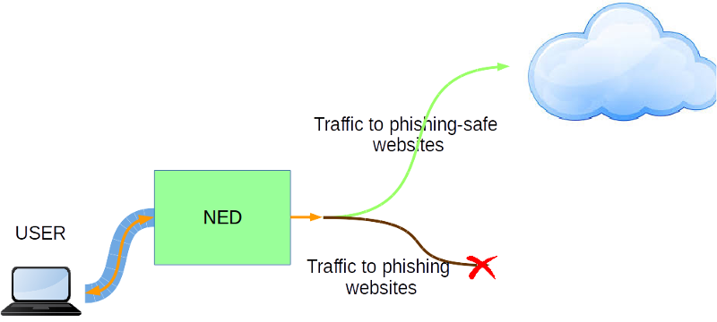

# 1. End-user 

## 1.1 Description / general readme

Nowadays, the internet is part of our lives. This means that as the network grows exponentially, so do the vulnerabilities in it, and the chances of infecting your computer with a virus or falling into any website that tries to get your credentials and use them for their own profit.

This PSA is mainly in charge of avoiding some of these attacks. Particularly, it is in charge of avoiding "Phishing", i.e., forbidding the user to visit malicious sites with a high probability of having their credentials stolen.

This PSA acts as a transparent proxy that filters all the traffic identified as malicious, using a public AWPG Anti-Phishing database. More specifically, the blacklist entered into the proxy may be found at [E-CrimeX](https://ecrimex.net/).

An schema for this PSA behavior would be:



## 1.2 Features / Capabilities

This PSA is able to filter unwanted site accesses using the blacklist.

The list of capabilities are (extracted from manifest):

* Antiphishing: offers the possibility of being protected of phishing attacks 

The internal used technologies are:
* Squid
* iptables
* ebtables
* jq

## 1.3 Security policy examples

The following examples list some possibly policies that can be enabled from the SECURED GGUI.

```I enable the antiphishing detection from [E-CrimeX](https://ecrimex.net/)```

* This policy configures antiphishing PSA to block the traffic to the domains detected as phishing, e.g., www.mega.nz.

## 1.4 Support, troubleshooting / known issues

Currently the blacklist is manually updated, having an autoupdate mechanism may be interesting.

# 2. Developer / admin

## Description / general readme

The Antiphishing PSA acts like a transparent proxy avoiding the access to phishing sites. This proxy is managed by Squid, checking the traffic and comparing it to a public blacklist containing many already known phishing urls. If the traffic destination does not belong to any site in the blacklist it allows the traffic normally.

## Components and Requirements

VM technology allows creating a full system for the PSA. The components used in this PSA are:

* Operative System: Debian 7 "wheezy"
* iptables 
* ebtables
* brigde-utils
* squid3
* jq

The blacklist must be located in "/home/psa/phishinglist" and must be a list of URLs, one per line.

This list should be updated once per week.

## Detailed architecture

There are several components in the internal architecture:

* **Inspect and route traffic**. **ebtables** is used to set up rules to inspect Ethernet frames between eth0 and eth1 and force the traffic to be routed instead of being just bridged. By this, the traffic will be routed through the Squid proxy. 

* **Filter the traffic**. **Squid** checks all the traffic, filtering it if it is detected as phishing.

### Rules

There are no rules

### Certificates

There are no needed certificates


## Virtual machine image creation

The procedure to create a valid PSA image from scratch start with the prerequisite instructions defined in  [PSA Developer guide](https://gitlab.secured-fp7.eu/secured/secured/blob/master/WP5/PSA_dev_guide.md) to obtain a valid base image for PSA. 

Install the required software:

```
	sudo apt-get -y install squid3 ebtables bridge-utils jq
```

Copy the necessary [files](https://gitlab.secured-fp7.eu/secured/psa-antiphishing/tree/master/PSA) of this project in the folder:

```
$HOME/phytonScript/
```

## Mobility Support
This PSA supports the mobility scenario.

## Support, troubleshooting / known issues

Currently the blacklist is manually updated, having an autoupdate mechanism may be interesting.

## Files required

No extra files required.

### PSA application image

PSA is based on a Virtual machine image in KVM- kernel module format ".qcow2". A [sample image has been included](https://vm-images.secured-fp7.eu/images/priv/antiphishingPSA.img) in the project.

### Manifest
* XML 

The PSA manifest in format XML is available at [Manifest](NED_files/TVDM/PSAManifest/antiphishingPSA.xml).
This file must be stored in the PSAR. And reflects the capabilities described below. 

* JSON

The PSA manifest in format JSON is available at [Manifest](NED_files/TVDM/PSAManifest/antiphishingPSA).


### HSPL

The HSPL format is defined as follows:

* D4.1 format:

```
father;enable;antiPhishing
```

* More friendly:

```
I enable Antiphishing
```


### MSPL

The MSPL is available at [MSPL](https://gitlab.secured-fp7.eu/secured/spm/blob/devel/M2LService/code/M2LPluginAnti_phishing/MSPL_cdac53ad-4228-4a6b-b31c-a3501463540d.xml)

### M2L Plug-in

The M2l plug-in is available at [M2LPlugin](https://gitlab.secured-fp7.eu/secured/spm/blob/devel/M2LService/code/M2LPluginAnti_phishing/src/eu/securedfp7/m2lservice/plugin/M2LPlugin.java)

For this PSA there is no user configuration to give to the user PSA. This is because all users will need the same configuration for Squid: check if the destination URL on the traffic is in the blacklist and block it.

This plugin do not need additional external information in this version that must be store in the PSAR.

## Features/Capabilities

The list of capabilities are (extracted from manifest):

* Antiphishing: offers the possibility of being protected of phishing attacks 

## Testing

Testing scripts are available at [test folder](tests/)


# 3. License

Please refer to project LICENSE file.

This software incorporates only Squid which is an open source software licensed under the [GNU GPL](http://www.gnu.org/licenses/gpl-3.0.en.html).

# Additional Information 
## Partners involved

* Application: UPC
* MSPL: POLITO,UPC 
* M2L Plugin: UPC

# Status (OK/No/Partial) -*OK*-

# TODO:
* Tests


